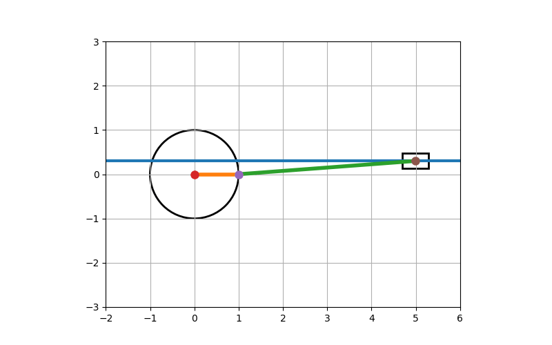
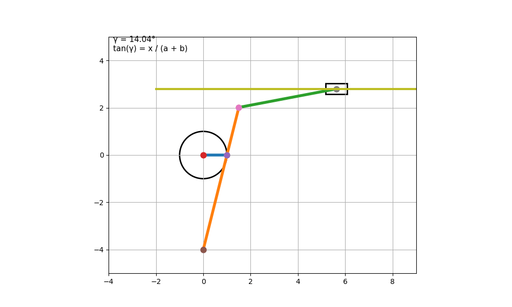

# Mechanism Simulations

A collection of Python simulations and animations for classical mechanical mechanisms developed in Google Colab.

## Included Mechanisms

- Crank-Slider Mechanism

- Whitworth Quick-Return Mechanism

## Features

- Interactive animations
- Kinematic visualization
- Parameter customization
- Google Colab compatible

## Technologies

- Python
- NumPy
- Matplotlib
- Google Colab

## Purpose

Educational simulations for studying the motion and kinematics of classical mechanical mechanisms.
